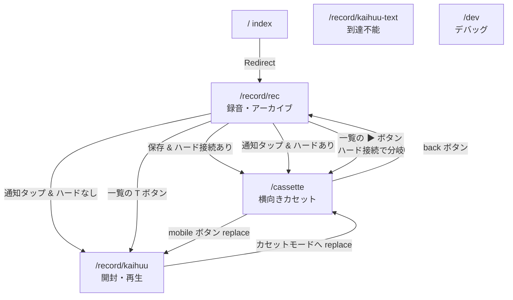
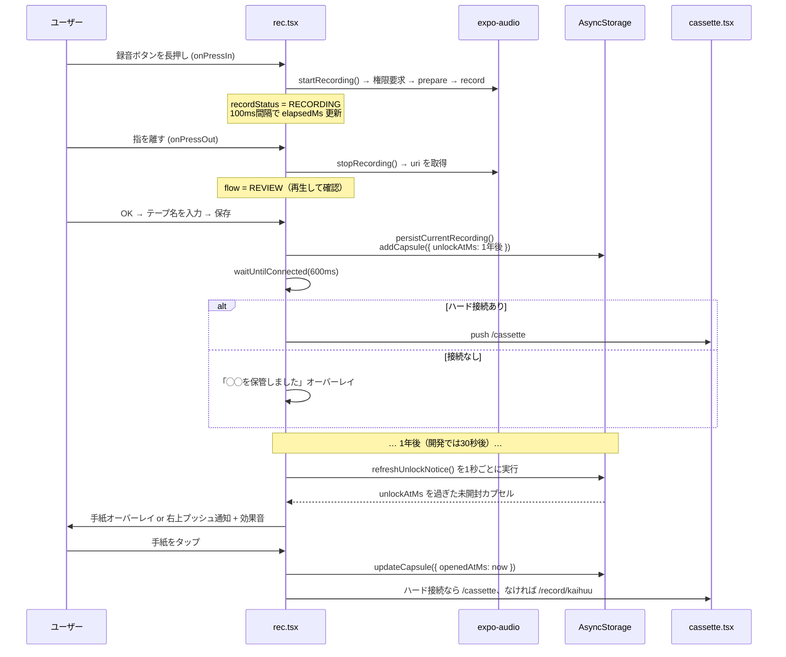
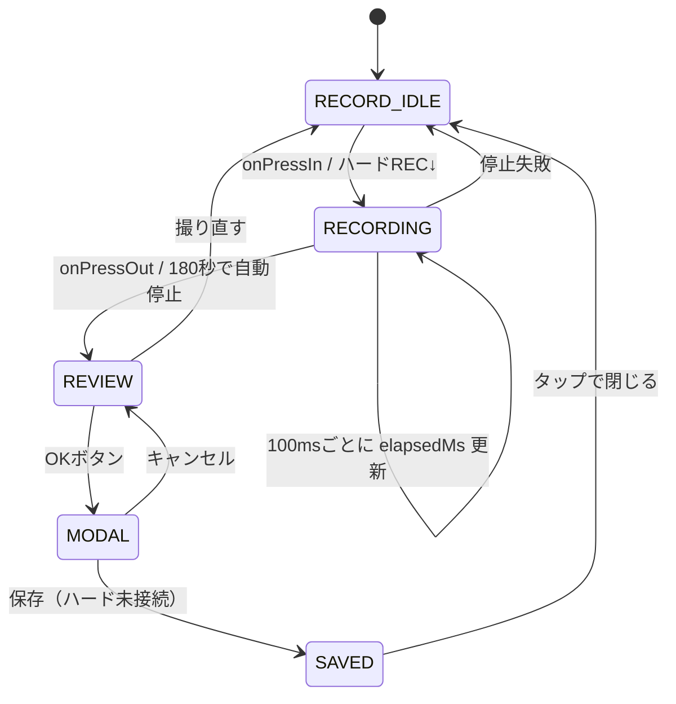
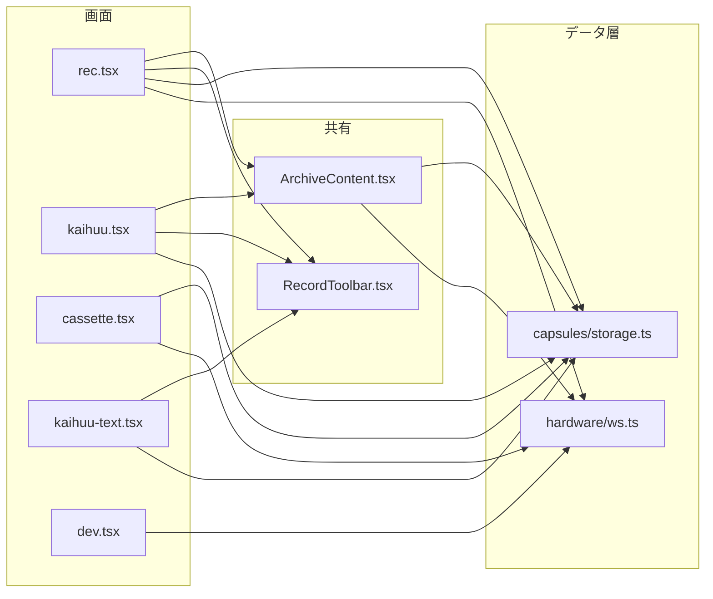

# Echo Capsule コードベース詳解

修正に着手する前に「今どうなっているか」を1本の線で追うためのドキュメント。

調査対象：`develop-hardware-tomorrow` ブランチ / コミット `5530366`（未コミットの変更を含む）
`tsc --noEmit` は型エラーなしで通過。`eslint` は警告3件（BOM）のみ。

| | |
|---|---|
| 実装コード | 約 7,133 行 |
| 画面 | 5 + デバッグ1 |
| 保存先 | AsyncStorage のみ |
| バックエンド | なし |
| テスト | 0 件 |

---

## 目次

1. [全体像](#1-全体像)
2. [ファイル構成](#2-ファイル構成--生きているコードと残骸)
3. [画面とルーティング](#3-画面とルーティング)
4. [データモデル](#4-データモデル--全データがここに集約)
5. [中心フロー](#5-中心フロー--録音から開封まで)
6. [rec.tsx](#6-rectsx--アプリの中心2407行)
7. [ArchiveContent.tsx](#7-archivecontenttsx--アーカイブ1472行)
8. [cassette.tsx](#8-cassettetsx--横向きカセット908行)
9. [kaihuu.tsx](#9-kaihuutsx--開封画面1087行)
10. [ハードウェア連携](#10-ハードウェア連携)
11. [状態管理の実態](#11-状態管理の実態)
12. [デモ用ハック一覧](#12-デモ用ハック一覧)
13. [読む順番と修正の影響範囲](#13-読む順番と修正の影響範囲)

---

## 1. 全体像

このアプリは3つの体験を1つのコードベースに同居させている。

- **① スマホで録る**（縦画面）
- **② カセット型ハードで再生する**（横画面）
- **③ 届いたカプセルを開封する**（縦画面）

この3つが別々の画面として実装され、**ハードが接続されているかどうか**で行き先が動的に切り替わる。

| 領域 | 採用技術 | 備考 |
|---|---|---|
| フレームワーク | Expo SDK 54 / RN 0.81.5 / React 19.1 | New Architecture 有効、React Compiler 実験機能も有効 |
| ルーティング | expo-router 6（ファイルベース） | Stack のみ。タブは実質未使用 |
| 音声 | expo-audio | 録音・再生とも。`expo-av` からの移行済み |
| 永続化 | @react-native-async-storage | キー3つだけ。DB・サーバーなし |
| ハード連携 | WebSocket（生API） | シングルトン1個。`src/hardware/ws.ts` |
| アニメーション | Animated（RN標準） | reanimated は入っているが未使用 |
| ジェスチャー | react-native-gesture-handler | タブ切替スワイプ、スワイプ削除 |
| 状態管理 | — | ライブラリなし。全部 useState + AsyncStorage |

> **設計上いちばん大事な特徴**
>
> グローバルな状態ストアが存在しない。画面をまたぐデータ共有は
> **「AsyncStorage に書いて、別画面が定期的に読み直す」** という形で実現されている。
> このポーリング構造が、後述する性能問題とバグの多くの根っこ。

---

## 2. ファイル構成 — 生きているコードと残骸

リポジトリには Expo テンプレートの初期ファイルがかなり残っている。
まず「触っていいファイル」と「見なくていいファイル」を分けておくと、理解の最初のコストが大きく下がる。

### 実装の本体（これだけ読めばいい）

| ファイル | 行数 | 役割 |
|---|---:|---|
| `app/record/rec.tsx` | 2,407 | アプリの中心。録音・保存・開封通知・アーカイブタブを全部持つ |
| `components/ArchiveContent.tsx` | 1,472 | アーカイブ画面の中身。カレンダー・検索・一覧・削除 |
| `app/record/kaihuu.tsx` | 1,087 | 開封後の再生画面 + テキストモード + アーカイブ |
| `app/cassette.tsx` | 908 | 横向きカセット画面。ホイール回転とハード操作 |
| `app/dev.tsx` | 247 | WebSocket 接続確認用デバッグ画面 |
| `app/record/kaihuu-text.tsx` | 262 | テキスト表示の独立画面 — **到達不能** |
| `components/RecordToolbar.tsx` | 159 | rec / archive のセグメント切替UI |
| `src/hardware/ws.ts` | 212 | WebSocket シングルトン + 自動再接続 |
| `src/capsules/storage.ts` | 69 | カプセルのデータ型と CRUD。**データ層はここが全部** |
| `app/_layout.tsx` | 43 | Stack 定義と画面ごとの向きロック |
| `app/index.tsx` | 4 | `/record/rec` へリダイレクトするだけ |

### テンプレートの残骸（今は読まなくていい）

- `app/(tabs)/` — タブ自体が `display:none` で無効化済み。`index.tsx` は rec 画面の二重登録、`explore.tsx` は ArchiveContent の二重登録
- `app/modal.tsx` — "This is a modal"
- `components/hello-wave.tsx`
- `components/parallax-scroll-view.tsx`
- `components/external-link.tsx`
- `components/themed-text.tsx` / `components/themed-view.tsx`
- `components/ui/collapsible.tsx` / `components/ui/icon-symbol*.tsx`
- `components/haptic-tab.tsx`
- `hooks/` / `constants/theme.ts` / `scripts/reset-project.js`

画像も `assets/images/react-logo*.png` と `partial-react-logo.png` がテンプレ由来。
`assets/images/TextButton.png` はどこからも参照されていない。

> ⚠️ **Git にコミットすべきでないものが入っている**
>
> `.vs/`（Visual Studio のワークスペース状態）と `.expo-export-check/` が
> `.gitignore` に入っていないため追跡されている。

---

## 3. 画面とルーティング

`app/_layout.tsx` がすべての画面をヘッダーなしの Stack に登録し、
**画面ごとに端末の向きをロック**している。ここが体験の骨格。

| ルート | 向き | 遷移アニメ | 役割 |
|---|---|---|---|
| `/` | — | — | `/record/rec` へリダイレクト |
| `/record/rec` | 指定なし | 既定 | 録音 + アーカイブ（横向きだと真っ黒になる） |
| `/record/kaihuu` | portrait | none | 開封 / 再生 / テキスト / アーカイブ |
| `/record/kaihuu-text` | portrait | slide | **到達不能** どこからも遷移されない |
| `/cassette` | landscape | none | カセット再生（ハード接続時のメイン） |
| `/dev` | 指定なし | 既定 | WS デバッグ。**本番ビルドにも同梱される** |

### 遷移グラフ



> **「ハードが繋がっているかで行き先が変わる」ロジックが3箇所に散らばっている**
>
> `rec.tsx:541`（保存時）、`rec.tsx:1196`（通知から開封時）、`ArchiveContent.tsx:301`（一覧の再生ボタン）。
> いずれも `await hardwareWS.waitUntilConnected()` の真偽で `/cassette` と `/record/kaihuu` を出し分ける。
> **接続していない環境では、この待機のぶんだけ毎回 0.45〜0.6 秒フリーズする。**

> ⚠️ **戻るスタックが壊れやすい構造**
>
> rec → cassette は `push`、cassette → kaihuu と kaihuu → cassette は `replace`。
> `replace` で往復すると履歴が積み上がらないため、cassette の「back」ボタンが
> どこに戻るかは、そこに至った経路によって変わる。

---

## 4. データモデル — 全データがここに集約

アプリが永続化するものは **AsyncStorage のキー3つだけ**。
`src/capsules/storage.ts` は69行しかなく、ここを読めばデータ層は全部把握できる。

### キー一覧

| キー | 型 | 書く場所 | 読む場所 |
|---|---|---|---|
| `echoCapsules` | `CapsuleRecord[]` | rec, cassette, kaihuu, Archive | 全画面 |
| `recordedDateKey` | `"YYYY-MM-DD"` | rec.tsx | rec.tsx, kaihuu.tsx |
| `dismissedUnlockNoticeIds` | `string[]` | rec.tsx | rec.tsx |

### CapsuleRecord

```ts
type CapsuleRecord = {
  id:            string;   // `capsule-{timestamp}-{random6}`
  title:         string;   // テープ名。未入力なら "2026/7/27" が入る
  audioUri:      string;   // ⚠ OSキャッシュ領域の絶対パス（消える）
  durationSec:   number;   // 録音長（秒）
  recordedAtMs:  number;   // 録音時刻
  unlockAtMs:    number;   // 開封可能になる時刻
  openedAtMs:    number | null;  // null = 未開封（緑ドットの根拠）
  hasTranscript: boolean;  // 常に true が入る（実装上の意味なし）
}
```

### この型の周りで押さえるべき3点

1. **`unlockAtMs` が「ロック中か」「未開封か」の唯一の根拠。**
   `nowMs >= unlockAtMs` が開封可能、それに加えて `openedAtMs === null` なら未開封（緑ドット表示）。
   この判定が `storage.ts` / `rec.tsx` / `ArchiveContent.tsx` / `cassette.tsx` の**4箇所に別々に書かれている**。

2. **`audioUri` はキャッシュ領域を指している。**
   expo-audio は iOS で `cachesDirectory`、Android で `context.cacheDir` に録音する。
   そのパスをそのまま保存して1年後に読むので、OSのキャッシュ削除で音声が失われる。

3. **CRUD は全件読み込み→全件書き戻し。**
   `addCapsule` / `updateCapsule` / `removeCapsule` はどれも
   「JSON全体をパース→配列を変更→JSON全体を保存」。排他制御がないので、
   1秒ポーリングと保存が重なると書き込みが消えることがある。

---

## 5. 中心フロー — 録音から開封まで



### 「1年後」がどこで決まるか

```ts
// rec.tsx:514 と cassette.tsx:251 に同じコードが2つある
const unlockAtMs = __DEV__
  ? recordedAtMs + 30 * 1000          // 開発ビルド：30秒後
  : defaultUnlockDate.getTime();      // 本番ビルド：1年後
```

デモの短縮がビルド種別に直結しているため、EAS build した本番アプリでは30秒デモが一切再現できない。
ここは実行時の設定値に切り出すのが自然。

### 開封通知の2つの見た目

通知は**今どの画面を見ているかで表示形式が変わる**（`rec.tsx:904-917`）。

| 条件 | 表示 | 実装 |
|---|---|---|
| rec タブ・録音中でない・モーダルなし | 全画面の手紙オーバーレイ（タップで開封） | `showUnlockNoticeOverlay` |
| それ以外（archive タブ、REVIEW中など） | 右上からスライドインするバナー + 効果音、8秒で消える | `showPushNotice` |

バナーは `pointerEvents="none"` なのでタップできない。閉じた通知のIDは
`dismissedUnlockNoticeIds` に記録され、再表示されなくなる。

> ❌ **この通知はアプリを開いている間しか発火しない**
>
> `expo-notifications` は導入されておらず、実体は `rec.tsx:1274` の `setInterval(…, 1000)`。
> 「1年後に届く」というコンセプトの中核イベントが、
> ユーザーが自発的にアプリを開いたときにしか起きない構造になっている。

---

## 6. rec.tsx — アプリの中心（2,407行）

1ファイルに**4つの独立した関心事**が同居している：
録音の状態機械 / タブのスライド / 開封通知 / 保存モーダル。
まずこの4つを分けて見るのが読み解きの鍵。

### 状態機械

画面の見た目は `flow`（2値）× `activeTab`（2値）で決まり、`recordStatus` が録音の実体を持つ。



| state | 取りうる値 | 意味 |
|---|---|---|
| `flow` | `record` \| `review` | 録音画面か、再生確認画面か |
| `recordStatus` | `idle` \| `recording` \| `recorded` | レコーダーの実状態 |
| `activeTab` | `rec` \| `archive` | 横スライドの位置 |
| `isProjectModalVisible` | `boolean` | テープ名入力モーダル |
| `isSaveComplete` | `boolean` | 「保管しました」オーバーレイ |

> ⚠️ **`recordStatusRef` という影の state がある**
>
> 非同期処理やWSコールバックの中から「今録音中か」を即座に知る必要があるため、
> `recordStatus` の値が `recordStatusRef.current` にも手動でコピーされている
> （`rec.tsx:224-226` と、各所の直接代入）。
> **片方だけ更新すると壊れる**ので、この state を触るときは必ず両方を見ること。

### タブのスライド実装

タブは画面遷移ではなく、**幅2倍のトラックを `translateX` で左右に動かす**だけ（`rec.tsx:1399-1605`）。
つまり**アーカイブ画面は常にマウントされ続けている**。
これが「アーカイブの1.5秒ポーリングが、録音画面を見ている間もずっと走っている」理由。

```ts
// アニメーションではなく即座にジャンプしている（rec.tsx:685-687）
useEffect(() => {
  slideX.setValue(activeTab === "rec" ? 0 : -slideWidth);
}, [activeTab, slideWidth, slideX]);
```

### アセットのプリロード

`rec.tsx:231-249` で、cassette / kaihuu のコードと22個の画像・フォントを起動時に先読みしている。
理由はコメントに書かれているとおり、**スマホをハードのWi-Fi APに繋ぎ替えると Metro に到達できなくなる**ため。
ハード連携デモのための実務的な対策で、これは意図された設計。

### この画面の主な問題点

- 🐛 ハードのRECボタンで録音すると保存されない（`rec.tsx:589` — 古いクロージャの `lastRecordedUri` が `null` のまま）
- 🐛 素早くタップすると録音が止まらなくなる（`startRecording` の await 完了前に `onPressOut` が来ると停止処理がスキップされる）
- 🐛 保存に失敗しても「保管しました」と表示される（`rec.tsx:552`）
- 🐢 録音中、WSの購読が100msごとに張り直される（`rec.tsx:635-642` の依存配列に `elapsedMs` 経由の依存がある）
- 💀 `isLockedToday = false` がハードコードされ（`rec.tsx:254`）、1日1回制限のUIだけが残っている

---

## 7. ArchiveContent.tsx — アーカイブ（1,472行）

独立した画面ではなく**コンポーネント**で、`embedded` プロパティで見た目を変えながら
`rec.tsx` と `kaihuu.tsx` の**両方に埋め込まれている**。つまり同時に2インスタンス存在しうる作り。

### 表示されるリストの正体

```ts
sortedLatest = [
  ...computedCapsuleItems,  // 実データ（AsyncStorage から）
  ...DUMMY_RECORDINGS       // ハードコードされた偽データ 12件
].sort(/* date 降順 */)
```

`ArchiveContent.tsx:70-191` の `DUMMY_RECORDINGS` には
"project 1"×3（2027-01-31）、"design memo"、"morning log" などが入っており、実データと同列にソートされる。
2027年日付のダミーが上位に来るため、開発モードで録ったばかりの実カプセルがその下に埋もれる。

### 4つのUI要素

1. **検索ボックス** — 入力があるとカレンダーを隠し、全件からタイトル部分一致で絞り込む
2. **カレンダー** — 開封日にドットを打つ。**未開封は緑画像、開封済みは灰色の丸**
3. **日付タップのモーダル** — その日の**1件目だけ**を表示（`selectedDateItems[0]` 固定。同日に複数あっても2件目以降は出ない）
4. **最新10件リスト** — 左スワイプで削除。削除できるのは `source === "capsule"` の実データのみ

### 行の各要素が何をするか

| 要素 | 動作 | 行き先 |
|---|---|---|
| 緑ドット | 未開封の印（表示のみ） | — |
| タイトル長押し | `Alert.alert` で全文表示 | — |
| ▶ 再生 | `openedAtMs` を記録 → ハード接続を確認 | `/cassette` か `/record/kaihuu` |
| T | 同上 → テキストモードで開く | `/record/kaihuu?mode=text` |
| 左スワイプ → 削除 | 確認モーダル → `removeCapsule` | — |

### この画面の主な問題点

- 🐛 カレンダーが35セル固定（`:225`）。6週にまたがる月は末日が表示されない
- 🐛 ダミー12件が実データに混在。削除も編集もできない
- 🐢 1.5秒ごとの全件再読込 + 1秒ごとの `setNowMs` で常時再レンダー
- 💀 `dotDateKeys` と `unlockedDateKeys`（`:392-407`）が完全に同一の計算
- 💾 `removeCapsule` は音声ファイルを消さない（孤児ファイルが蓄積）

---

## 8. cassette.tsx — 横向きカセット（908行）

**852×393 の固定デザインを、画面サイズに合わせて丸ごと拡大縮小する**という
他の画面とまったく違うレイアウト方式を採っている。

```ts
const uiScale = Math.min(windowWidth / 852, windowHeight / 393);
// 以降、すべての座標・サイズに uiScale を掛けて絶対配置する
left: boardLeft + LEFT_WHEEL_X * uiScale,
width: LEFT_WHEEL_SIZE * uiScale,
```

Flexbox をほぼ使わず、リール・カバー・下部バーをすべて `position: absolute` で置いている。
レイアウトを直すときは、この係数計算を通して考える必要がある。

### リール回転の仕組み

`rotateProgress`（0→1）を6秒でループさせ、左リールは `-360deg`、右リールは `+360deg` に補間している。
一時停止したときに**回転角を維持して途中から再開する**ため、
`progressRef` に現在値を退避する処理が入っている（`cassette.tsx:509-558`）。地味だが丁寧な実装。

### 複数カプセルのページ送り

開封済みカプセルを配列で持ち、`activeCapsuleIndex` で切り替える。
切替は左右スワイプ、またはハードのSTOPボタン。
画面全体を `translateX` でスライドアウト → インデックス変更 → スライドインさせる。
遷移中のフラグ管理に `isProjectSlideTransitioningRef` / `pendingMoveDeltaRef` /
`pendingPageInAfterIntroRef` の3つの ref を使っており、**このファイルで最も複雑な箇所**。

### この画面の主な問題点

- ℹ️ **画面上に再生ボタンはない（意図的）。** 再生・停止はハードの PLAY ボタンだけで行う。画面で操作したい場合は下部バーの mobile mode から kaihuu 画面へ移る、という役割分担。以前あった 1×1px の不可視な長押し領域は削除済み（判断の経緯は `docs/TASKS.md` の C-1）
- 🐛 ハード録音に長さ上限がない（rec.tsx は180秒でカット）
- 🐛 RECを短く押すと、権限要求の await 中に停止処理が走り、録音が回りっぱなしになる
- 💀 `shouldPlayArrivalIntro = true` という定数（`:122`）。`params.showArrivalIntro` は渡されているが使われていない
- 🎭 `FORCE_ARRIVAL_INTRO_PREVIEW_ON_RELOAD = __DEV__` により、本番ビルドでは登場演出が出なくなる

---

## 9. kaihuu.tsx — 開封画面（1,087行）

**いちばん状態が入り組んでいる画面。**
1つのコンポーネントが、独立した3つのフラグの組み合わせで4種類の見た目を出し分ける。

| `activeTab` | `showMainArchive` | `isTextMode` | 表示されるもの |
|---|---|---|---|
| `rec` | — | — | 録音ボタン（**押しても何も起きない飾り**） |
| `archive` | `false` | `false` | カプセルの音声プレイヤー |
| `archive` | `false` | `true` | 文字起こし（紙のボード） |
| `archive` | `true` | — | ArchiveContent（一覧） |

> ⚠️ **rec タブの録音ボタンには `onPress` がない**（`kaihuu.tsx:622-644`）
>
> `disabled` と画像切替だけが実装された見た目だけのボタン。
> この画面から録音したい場合は、ツールバーで rec 画面に戻る必要がある。

### 音声とモックの二重実装

`capsuleId` が渡されなかった場合に備えて、**60秒のダミー再生シミュレータ**が併存している
（`:302-316`、`MOCK_DURATION_MS`）。
実音声がないときは `setInterval` で `positionMillis` を100msずつ進めるだけの偽の再生が動く。
`togglePlay` の中もこの2系統で分岐しており、読みづらさの主因になっている。

### この画面の主な問題点

- 💾 `openAllDay21Capsules`（`:155-169`）— **マウント時に「開封日が21日」のカプセルを全部既読化する**。デモ当日用のハックがユーザーデータを無断で書き換えている
- 🎭 文字起こしが `"こんにちはー"` / `"おはようございますー"` のハードコード
- 💀 `isLockedToday` がここでは**まだ有効**（`:368`）。rec.tsx では無効化されているため、画面間で仕様が矛盾
- 💀 `shouldPlayArrivalIntro = true` 定数、および常に `duration: 0` の `translateX` アニメーション（`:465-470`）
- 🖥 横向きにすると背景画像だけが表示される（`:503-519`）

---

## 10. ハードウェア連携

`src/hardware/ws.ts` は `hardwareWS` という**モジュールスコープのシングルトン**を1つ export しているだけ。
React の外に生きているので、画面をまたいで接続が維持される。

### プロトコル

接続先は `ws://192.168.46.1/ws`（`app.json` の `extra.hardware.wsUrl` で上書き可、既定値はコード内）。
ハードから送られてくるのは**3つのボタンの押下状態だけ**。

```json
{ "stop": false, "play": true, "rec": false }
```

アプリ側は前回の状態と比較して**立ち上がり（down）と立ち下がり（up）を検出**し、イベントに変換する。

### 信号 → 動作の対応表

| 信号 | rec.tsx での動作 | cassette.tsx での動作 |
|---|---|---|
| REC ↓ | 録音開始 | 録音開始 |
| REC ↑ | 停止 → 保存 → /cassette へ ⚠️保存が動かない | 停止 → 保存 |
| STOP ↓ | 停止 → 保存 → /cassette へ ⚠️同上 | 再生停止 + 次のカプセルへ |
| PLAY ↓ | — | 再生開始 |
| PLAY ↑ | — | 一時停止 |

cassette では PLAY が「押している間だけ再生」（トグルではない）挙動になっている点に注意。

### 接続管理

- **自動再接続あり、上限なし。** `min(5000, 700 × 試行回数)` の間隔で永久にリトライする。ハードがない環境でも延々と接続を試み続ける
- `waitUntilConnected(timeoutMs = 450)` が画面遷移の分岐に使われる。接続済みなら即 true、未接続なら接続を試みてタイムアウトまで待つ
- `subscribe` / `subscribeConnection` / `subscribeStatus` の3系統のリスナーがあり、`app/dev.tsx` は3つ目を使って状態を可視化している

> ❌ **本番ビルドで繋がらない可能性がある**
>
> `app.json` に ATS 例外（`NSAppTransportSecurity`）の設定がないため、
> iOS のリリースビルドでは平文の `ws://` がブロックされる。
> Android も API 28 以降は平文通信が既定で拒否される。

### デバッグ画面

`app/dev.tsx` は接続状態・再接続回数・最終受信時刻・3ボタンのON/OFFを表示する、よくできた確認用画面。
**現地でのハード接続確認には、まずこの画面を開くのが正解。**
ただし本番ビルドにも含まれてしまう点は対処が要る。

---

## 11. 状態管理の実態

画面をまたぐ同期は、すべて**「AsyncStorage に書く → 別画面がポーリングで読み直す」**で実現されている。
現在動いているポーリングは以下のとおり。

| 場所 | 間隔 | 処理 | いつ動くか |
|---|---:|---|---|
| `rec.tsx:1274` | 1,000ms | `loadCapsules()` 全件読込 → 開封判定 | rec タブでアイドル中ずっと |
| `ArchiveContent:354` | 1,500ms | `loadCapsules()` 全件読込 | 画面フォーカス中ずっと |
| `ArchiveContent:363` | 1,000ms | `setNowMs()` → 全体再レンダー | マウント中ずっと |
| `rec.tsx:839` | 100ms | 経過時間の更新と180秒での自動停止 | 録音中のみ |
| `rec.tsx:732` | 日付変更時 | 次の深夜0時に `now` を更新 | 常時（1回だけのタイマー再帰） |

> ⚠️ ArchiveContent は rec 画面に**常時マウントされている**（タブはスライドで隠しているだけ）ので、
> 録音画面を眺めているだけの状態でも**毎秒2回の全件JSONパースと全体再レンダー**が走り続ける。

### ファイル依存関係



`storage.ts` と `ws.ts` が全画面のハブ。
**この2ファイルを直せば全画面に効く**ので、修正の起点として最も効率がいい場所。

### 重複しているコード

共有モジュールが薄いぶん、同じロジックが各画面にコピーされている。
画面間の仕様のズレは、ほぼすべてこの重複が原因。

| 重複しているもの | 箇所数 | ある場所 |
|---|---:|---|
| `toDateKey()` | 4 | rec, kaihuu, ArchiveContent, storage |
| `formatDisplayDate()` / `WEEKDAY` | 4 | rec, kaihuu, kaihuu-text, cassette |
| `formatMillis()` | 2 | rec, kaihuu（区切り文字が違う） |
| 「1年後」の算出 | 3 | rec×2, cassette |
| `DEV_UNLOCK_DELAY_MS` | 2 | rec, cassette |
| `TRANSPARENT_THUMB` | 2 | rec, kaihuu |
| スワイプ判定ロジック | 4 | rec, kaihuu, kaihuu-text, cassette |
| 開封済み判定 | 4 | rec, ArchiveContent, kaihuu, cassette |

---

## 12. デモ用ハック一覧

展示・デモを通すために入れられた仕掛けが、本流のコードに残ったままになっている。
**これらを知らずに他の場所を直すと、原因不明の挙動に見える。**
修正前に全部把握しておくべきリスト。

| ハック | 場所 | 今の影響 |
|---|---|---|
| **開封待ち30秒** — `__DEV__` で分岐 | `rec.tsx:514`<br>`cassette.tsx:251` | 本番ビルドではデモが再現不能 |
| **21日のカプセルを全既読化** | `kaihuu.tsx:155` | 画面を開くたびユーザーデータを無断で書き換える |
| **ダミー録音12件** | `ArchiveContent.tsx:70` | 実データに混在。削除不可。実カプセルが埋もれる |
| **固定の文字起こし** | `kaihuu-text.tsx:40`<br>`kaihuu.tsx:373` | 全カプセルで「こんにちはー」が表示される |
| **1日1回制限を無効化** — `isLockedToday = false` | `rec.tsx:254` | rec では無効、kaihuu では有効。仕様が矛盾 |
| **登場演出を強制表示** | `cassette.tsx:51` | `__DEV__` 依存。本番では演出が消える |
| **Web の R キーで通知プレビュー** | `rec.tsx:924-936` | 害はないがデバッグ用の残り |
| **起動時に `recordedDateKey` を消す** | `rec.tsx:701` | `__DEV__` 時のみ。デモの繰り返し用 |
| ~~**不可視の再生トグル**~~ | `cassette.tsx` | 削除済み。再生はハードの PLAY に一本化 |
| **`hasTranscript` を常に true** | `rec.tsx:528` | 全カプセルで T ボタンが有効に見える |

---

## 13. 読む順番と修正の影響範囲

### コードを追う順番

1. **`src/capsules/storage.ts`（69行）**
   データ型と保存の全体。これを理解すれば、他の全ファイルが何を読み書きしているか分かる。

2. **`src/hardware/ws.ts`（212行）**
   ハード連携の全体。React に依存しない普通のクラスなので単体で読める。

3. **`app/_layout.tsx` + `app/index.tsx`（47行）**
   画面の一覧と向きのロック。アプリの骨格。

4. **`app/dev.tsx`（247行）**
   `ws.ts` の使われ方の一番シンプルな例。実機で動かしながら読むと理解が早い。

5. **`app/record/rec.tsx` の *ロジック部分のみ*（1〜1290行）**
   1880行目以降はすべて `StyleSheet` なので飛ばして構わない。実質1,290行。

6. **`components/ArchiveContent.tsx` の 1〜510行**
   こちらも984行目以降はスタイル。データ整形とフィルタのロジックはこの範囲に収まっている。

7. **`app/cassette.tsx` → `app/record/kaihuu.tsx`**
   最後で構わない。`kaihuu.tsx` が一番複雑なので、他を理解してから読むのが楽。

> **ヒント**：4ファイルとも後半が丸ごと `StyleSheet.create`。
> 総7,133行のうち、実際のロジックは**おおよそ3,500行程度**。見た目ほどの分量はない。

### 修正の影響範囲マップ

| 直したいもの | 触るファイル | 影響 |
|---|---|---|
| マイク権限・ATS | `app.json` のみ | コード変更ゼロ。**最も安全で効果が大きい** |
| 音声の保存先を永続領域へ | `storage.ts` + 保存する3箇所 | データ層中心。既存データの移行を考える必要あり |
| 開封待ち時間の設定化 | `rec.tsx`, `cassette.tsx` | 共通モジュールに切り出せば以降は1箇所 |
| ダミーデータ削除 | `ArchiveContent.tsx` のみ | 局所的。`source` 分岐も一緒に整理できる |
| ハード録音の保存バグ | `rec.tsx` の2箇所 | `stopRecording` の戻り値を渡すだけ。局所的 |
| 録音の競合状態 | `rec.tsx`, `cassette.tsx` | 状態機械の見直しが要る。**最も慎重を要する** |
| ポーリングの削減 | 全画面 | 共有ストア導入が前提。実質リファクタリング |
| プッシュ通知の実装 | 新規 + `rec.tsx` | 新規ライブラリ導入。設計から必要 |
